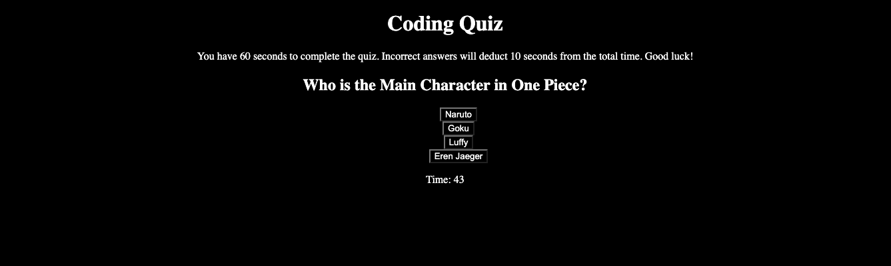

# Coding Quiz

## Description

This App is a simple 3 question multiple challenge quiz. You will be given 60 seconds to complete the quiz, deducting time for incorrect answers. Once the quiz is finished you will be asked to submit your initials and your final score will be displayed along with the scores of previous users.

## Technologies Used

HTML  
CSS  
JavaScript

## Installation

There is no installation necessary, the app may be accessed via this link - https://casignacio.github.io/code-quiz/

## Usage

To start the quiz, press the "Start Quiz" button on the landing page. You will be led through a series of questions, ending with the score page.

